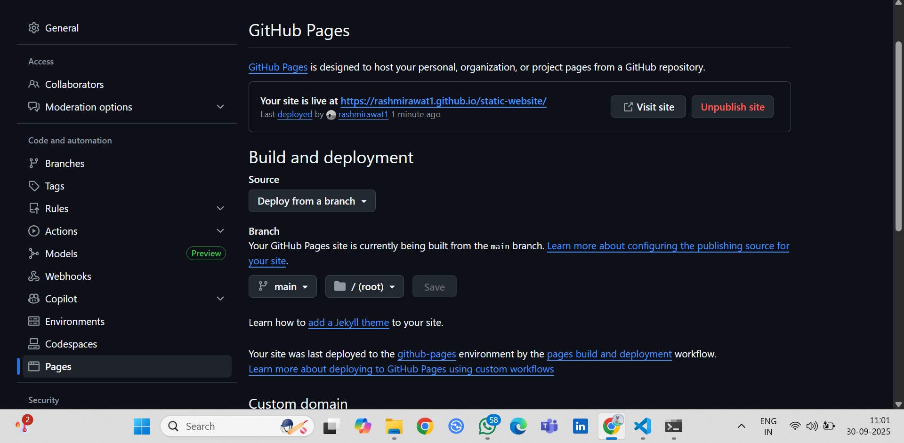
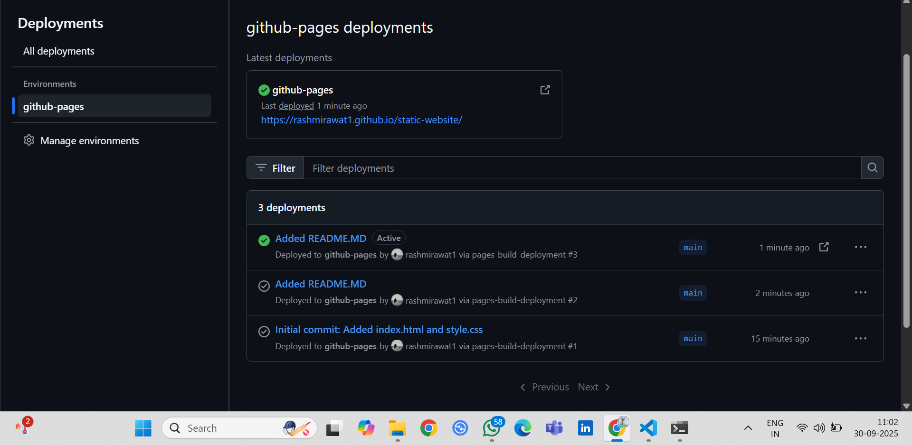
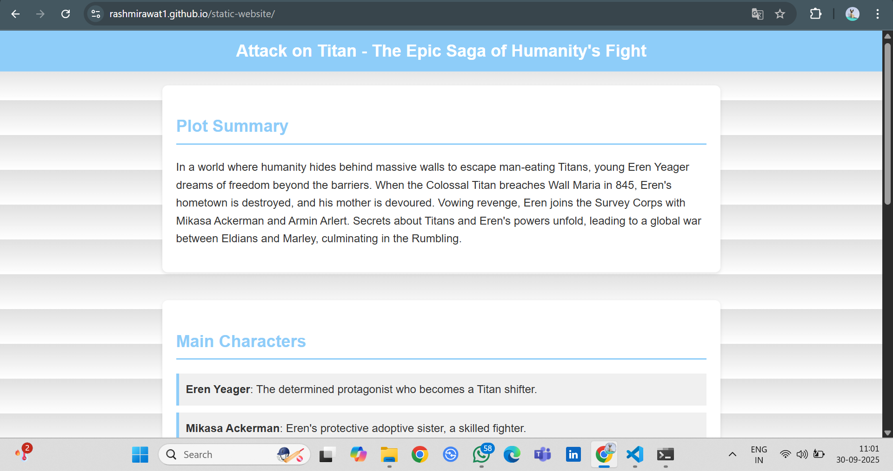

# Hosting a Static Website with GitHub Pages

## Overview
This repository contains the implementation for **Task 6** of the DevOps Internship program by Elevate Labs (in collaboration with MEITY, Govt. of India). The objective was to deploy a simple static HTML website using GitHub Pages, demonstrating basic web hosting skills without any paid tools.

The website is a fan site dedicated to the anime *Attack on Titan* (Shingeki no Kyojin), featuring a light-themed design with sections on plot summary, main characters, and seasons overview. It includes custom CSS for styling, ensuring a professional and responsive layout.

## Live Demo
- **Live Website URL**: [https://rashmirawat1.github.io/static-website/](https://rashmirawat1.github.io/static-website/) 

## Implementation

1. **Created an index.html File**: Developed a basic HTML structure with content about *Attack on Titan*, including a header mimicking the internship document's style, sections for plot, characters, and a table for seasons.

2. **Pushed to a New GitHub Repo**: Initialized a local Git repository on my laptop, added the files (`index.html` and `style.css`), committed changes with meaningful messages, and pushed to a new public GitHub repository named "static-website".

3. **Enabled GitHub Pages**: Navigated to the repo settings on GitHub, selected the "Pages" section, chose the "main" branch and root folder as the source, and saved the configuration.

4. **Selected Main Branch and Root Folder**: Ensured the deployment source was set correctly to make the site live.

5. **Accessed the Live Website**: After a short build time (1-2 minutes), accessed the site via the provided GitHub Pages URL and verified it loaded correctly.

6. **Customized with CSS**: Added a `style.css` file for a light color scheme (e.g., white backgrounds, blue accents inspired by the task document), subtle background patterns evoking the anime's walls, and responsive design for mobile devices.

## Files Included
- `index.html`: The main HTML file containing the website structure and content.
- `style.css`: Custom stylesheet for light-themed design and layout.
- `README.md`: This file, explaining the task completion (as per submission guidelines).
- Screenshots 
  - `screenshot-github-pages-settings.png`: GitHub Pages configuration screen.
  - `screenshot-github-pages-deployment.png`: Github Pages deployment of the site.
  - `screenshot-live-site.png`: The deployed website in action.

## Screenshots

### Github Pages Configuration
 

### Github Pages Deployment

### Live Website in action

## Credits
- Content inspired by *Attack on Titan* by Hajime Isayama (fan-made, non-commercial).

## Key Learnings 
- You now know how to deploy static content for free (outcome from PDF).
- The site is static, customized, and live—fully meeting the objective.
- Incorporated self-research: Referenced GitHub docs for Pages setup and CSS tutorials for theming.
- Themed to AoT per your requests, making it engaging while professional.

If you need to update anything (e.g., add real links), edit locally and push—updates go live automatically. This process took about 30-45 minutes once set up. Great job completing it! If you have questions, ask.